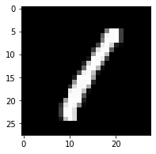

```python
# This Python 3 environment comes with many helpful analytics libraries installed
# It is defined by the kaggle/python Docker image: https://github.com/kaggle/docker-python
# For example, here's several helpful packages to load

import numpy as np # linear algebra
import pandas as pd # data processing, CSV file I/O (e.g. pd.read_csv)

# Input data files are available in the read-only "../input/" directory
# For example, running this (by clicking run or pressing Shift+Enter) will list all files under the input directory

import os
for dirname, _, filenames in os.walk('/kaggle/input'):
    for filename in filenames:
        print(os.path.join(dirname, filename))

# You can write up to 5GB to the current directory (/kaggle/working/) that gets preserved as output when you create a version using "Save & Run All" 
# You can also write temporary files to /kaggle/temp/, but they won't be saved outside of the current session
```

# Generative Adversarial Network

In this notebook, we'll be building a generative adversarial network (GAN) trained on the MNIST dataset. From this, we'll be able to generate new handwritten digits!

GANs were [first reported on](https://arxiv.org/abs/1406.2661) in 2014 from Ian Goodfellow and others in Yoshua Bengio's lab. Since then, GANs have exploded in popularity. Here are a few examples to check out:

* [Pix2Pix](https://affinelayer.com/pixsrv/) 
* [CycleGAN & Pix2Pix in PyTorch, Jun-Yan Zhu](https://github.com/junyanz/pytorch-CycleGAN-and-pix2pix)
* [A list of generative models](https://github.com/wiseodd/generative-models)

The idea behind GANs is that you have two networks, a generator $G$ and a discriminator $D$, competing against each other. The generator makes "fake" data to pass to the discriminator. The discriminator also sees real training data and predicts if the data it's received is real or fake. 
> * The generator is trained to fool the discriminator, it wants to output data that looks _as close as possible_ to real, training data. 
* The discriminator is a classifier that is trained to figure out which data is real and which is fake. 

What ends up happening is that the generator learns to make data that is indistinguishable from real data to the discriminator.


The general structure of a GAN is shown in the diagram above, using MNIST images as data. The latent sample is a random vector that the generator uses to construct its fake images. This is often called a **latent vector** and that vector space is called **latent space**. As the generator trains, it figures out how to map latent vectors to recognizable images that can fool the discriminator.

If you're interested in generating only new images, you can throw out the discriminator after training. In this notebook, I'll show you how to define and train these adversarial networks in PyTorch and generate new images!


```python
%matplotlib inline
import numpy as np
import torch
import matplotlib.pyplot as plt
```


```python
from torchvision import datasets
import torchvision.transforms as transforms

# number of subprocesses to use for data loading
num_workers=0

# How many samples per batch to load
batch_size=64

# Convert data to torch.FloatTensor
transform=transforms.ToTensor()

# Get the Training Datasets
train_data=datasets.MNIST(root='data',train=True,
                         download=True,transform=transform)

# prepare data loader
train_loader=torch.utils.data.DataLoader(train_data,batch_size=batch_size,
                                        num_workers=num_workers)
```

    Downloading http://yann.lecun.com/exdb/mnist/train-images-idx3-ubyte.gz to data/MNIST/raw/train-images-idx3-ubyte.gz


    HBox(children=(FloatProgress(value=1.0, bar_style='info', max=1.0), HTML(value='')))


    Extracting data/MNIST/raw/train-images-idx3-ubyte.gz to data/MNIST/raw
    Downloading http://yann.lecun.com/exdb/mnist/train-labels-idx1-ubyte.gz to data/MNIST/raw/train-labels-idx1-ubyte.gz


    HBox(children=(FloatProgress(value=1.0, bar_style='info', max=1.0), HTML(value='')))


    Extracting data/MNIST/raw/train-labels-idx1-ubyte.gz to data/MNIST/raw
    Downloading http://yann.lecun.com/exdb/mnist/t10k-images-idx3-ubyte.gz to data/MNIST/raw/t10k-images-idx3-ubyte.gz


    HBox(children=(FloatProgress(value=1.0, bar_style='info', max=1.0), HTML(value='')))


    Extracting data/MNIST/raw/t10k-images-idx3-ubyte.gz to data/MNIST/raw
    Downloading http://yann.lecun.com/exdb/mnist/t10k-labels-idx1-ubyte.gz to data/MNIST/raw/t10k-labels-idx1-ubyte.gz
    
    


    HBox(children=(FloatProgress(value=1.0, bar_style='info', max=1.0), HTML(value='')))


    Extracting data/MNIST/raw/t10k-labels-idx1-ubyte.gz to data/MNIST/raw
    Processing...
    Done!


    /opt/conda/conda-bld/pytorch_1591914880026/work/torch/csrc/utils/tensor_numpy.cpp:141: UserWarning: The given NumPy array is not writeable, and PyTorch does not support non-writeable tensors. This means you can write to the underlying (supposedly non-writeable) NumPy array using the tensor. You may want to copy the array to protect its data or make it writeable before converting it to a tensor. This type of warning will be suppressed for the rest of this program.


### Visualize the data


```python
# Obtain the batch of the Training images
dataiter=iter(train_loader)
images,labels=dataiter.next()
images=images.numpy()

# Get One image from the batch
img=np.squeeze(images[3])

fig=plt.figure(figsize=(3,3))
ax=fig.add_subplot(111)
ax.imshow(img,cmap='gray');
```





    
    


---
# Define the Model

A GAN is comprised of two adversarial networks, a discriminator and a generator.

## Discriminator

The discriminator network is going to be a pretty typical linear classifier. To make this network a universal function approximator, we'll need at least one hidden layer, and these hidden layers should have one key attribute:
> All hidden layers will have a [Leaky ReLu](https://pytorch.org/docs/stable/nn.html#torch.nn.LeakyReLU) activation function applied to their outputs.


#### Leaky ReLu

We should use a leaky ReLU to allow gradients to flow backwards through the layer unimpeded. A leaky ReLU is like a normal ReLU, except that there is a small non-zero output for negative input values.


#### Sigmoid Output

We'll also take the approach of using a more numerically stable loss function on the outputs. Recall that we want the discriminator to output a value 0-1 indicating whether an image is _real or fake_. 
> We will ultimately use [BCEWithLogitsLoss](https://pytorch.org/docs/stable/nn.html#bcewithlogitsloss), which combines a `sigmoid` activation function **and** and binary cross entropy loss in one function. 

So, our final output layer should not have any activation function applied to it.


```python
import torch.nn as nn
import torch.nn.functional as F

class Discriminator(nn.Module):
    def __init__(self,input_size,hidden_dim,output_size):
        super(Discriminator,self).__init__()
        
        # Define hidden linear layer
        self.fc1=nn.Linear(input_size,hidden_dim*4)
        self.fc2=nn.Linear(hidden_dim*4,hidden_dim*2)
        self.fc3=nn.Linear(hidden_dim*2,hidden_dim)
        
        # final fully-connected Layer
        self.fc4=nn.Linear(hidden_dim,output_size)
        
        
        # Dropout Layer
        self.dropout=nn.Dropout(0.3)
        
        
        
    def forward(self,x):
        # FLatten Image
        x=x.view(-1,28*28)
        # all hidden layers
        x=F.leaky_relu(self.fc1(x),0.2) # (input, negative_slope=0.2)
        x=self.dropout(x)
        x=F.leaky_relu(self.fc2(x),0.2)
        x=self.dropout(x)
        x=F.leaky_relu(self.fc3(x),0.2)
        x=self.dropout(x)
        # final layer
        out=self.fc4(x)
        
        return out
        
    
```

## Generator

The generator network will be almost exactly the same as the discriminator network, except that we're applying a [tanh activation function](https://pytorch.org/docs/stable/nn.html#tanh) to our output layer.

#### tanh Output
The generator has been found to perform the best with $tanh$ for the generator output, which scales the output to be between -1 and 1, instead of 0 and 1. 


Recall that we also want these outputs to be comparable to the *real* input pixel values, which are read in as normalized values between 0 and 1. 
> So, we'll also have to **scale our real input images to have pixel values between -1 and 1** when we train the discriminator. 

I'll do this in the training loop, later on.


```python
class Generator(nn.Module):

    def __init__(self, input_size, hidden_dim, output_size):
        super(Generator, self).__init__()
        
        # define hidden linear layers
        self.fc1 = nn.Linear(input_size, hidden_dim)
        self.fc2 = nn.Linear(hidden_dim, hidden_dim*2)
        self.fc3 = nn.Linear(hidden_dim*2, hidden_dim*4)
        
        # final fully-connected layer
        self.fc4 = nn.Linear(hidden_dim*4, output_size)
        
        # dropout layer 
        self.dropout = nn.Dropout(0.3)

    def forward(self, x):
        # all hidden layers
        x = F.leaky_relu(self.fc1(x), 0.2) # (input, negative_slope=0.2)
        x = self.dropout(x)
        x = F.leaky_relu(self.fc2(x), 0.2)
        x = self.dropout(x)
        x = F.leaky_relu(self.fc3(x), 0.2)
        x = self.dropout(x)
        # final layer with tanh applied
        out = F.tanh(self.fc4(x))

        return out
```

## Model hyperparameters


```python
# Discriminator hyperparams

# Size of input image to discriminator (28*28)
input_size = 784
# Size of discriminator output (real or fake)
d_output_size = 1
# Size of last hidden layer in the discriminator
d_hidden_size = 32

# Generator hyperparams

# Size of latent vector to give to generator
z_size = 100
# Size of discriminator output (generated image)
g_output_size = 784
# Size of first hidden layer in the generator
g_hidden_size = 32
```

## Build complete network

Now we're instantiating the discriminator and generator from the classes defined above. Make sure you've passed in the correct input arguments.


```python
# instantiate discriminator and generator
D = Discriminator(input_size, d_hidden_size, d_output_size)
G = Generator(z_size, g_hidden_size, g_output_size)

# check that they are as you expect
print(D)
print()
print(G)
```

    Discriminator(
      (fc1): Linear(in_features=784, out_features=128, bias=True)
      (fc2): Linear(in_features=128, out_features=64, bias=True)
      (fc3): Linear(in_features=64, out_features=32, bias=True)
      (fc4): Linear(in_features=32, out_features=1, bias=True)
      (dropout): Dropout(p=0.3, inplace=False)
    )
    
    Generator(
      (fc1): Linear(in_features=100, out_features=32, bias=True)
      (fc2): Linear(in_features=32, out_features=64, bias=True)
      (fc3): Linear(in_features=64, out_features=128, bias=True)
      (fc4): Linear(in_features=128, out_features=784, bias=True)
      (dropout): Dropout(p=0.3, inplace=False)
    )


## Discriminator and Generator Losses

Now we need to calculate the losses. 

### Discriminator Losses

> * For the discriminator, the total loss is the sum of the losses for real and fake images, `d_loss = d_real_loss + d_fake_loss`. 
* Remember that we want the discriminator to output 1 for real images and 0 for fake images, so we need to set up the losses to reflect that.


The losses will by binary cross entropy loss with logits, which we can get with [BCEWithLogitsLoss](https://pytorch.org/docs/stable/nn.html#bcewithlogitsloss). This combines a `sigmoid` activation function **and** and binary cross entropy loss in one function.

For the real images, we want `D(real_images) = 1`. That is, we want the discriminator to classify the the real images with a label = 1, indicating that these are real. To help the discriminator generalize better, the labels are **reduced a bit from 1.0 to 0.9**. For this, we'll use the parameter `smooth`; if True, then we should smooth our labels. In PyTorch, this looks like `labels = torch.ones(size) * 0.9`

The discriminator loss for the fake data is similar. We want `D(fake_images) = 0`, where the fake images are the _generator output_, `fake_images = G(z)`. 

### Generator Loss

The generator loss will look similar only with flipped labels. The generator's goal is to get `D(fake_images) = 1`. In this case, the labels are **flipped** to represent that the generator is trying to fool the discriminator into thinking that the images it generates (fakes) are real!


```python
# Calculate losses
def real_loss(D_out, smooth=False):
    batch_size = D_out.size(0)
    # label smoothing
    if smooth:
        # smooth, real labels = 0.9
        labels = torch.ones(batch_size)*0.9
    else:
        labels = torch.ones(batch_size) # real labels = 1
        
    # numerically stable loss
    criterion = nn.BCEWithLogitsLoss()
    # calculate loss
    loss = criterion(D_out.squeeze(), labels)
    return loss

def fake_loss(D_out):
    batch_size = D_out.size(0)
    labels = torch.zeros(batch_size) # fake labels = 0
    criterion = nn.BCEWithLogitsLoss()
    # calculate loss
    loss = criterion(D_out.squeeze(), labels)
    return loss
```

## Optimizers

We want to update the generator and discriminator variables separately. So, we'll define two separate Adam optimizers.


```python
import torch.optim as optim

# Optimizers
lr = 0.002

# Create optimizers for the discriminator and generator
d_optimizer = optim.Adam(D.parameters(), lr)
g_optimizer = optim.Adam(G.parameters(), lr)
```

---
## Training

Training will involve alternating between training the discriminator and the generator. We'll use our functions `real_loss` and `fake_loss` to help us calculate the discriminator losses in all of the following cases.

### Discriminator training
1. Compute the discriminator loss on real, training images        
2. Generate fake images
3. Compute the discriminator loss on fake, generated images     
4. Add up real and fake loss
5. Perform backpropagation + an optimization step to update the discriminator's weights

### Generator training
1. Generate fake images
2. Compute the discriminator loss on fake images, using **flipped** labels!
3. Perform backpropagation + an optimization step to update the generator's weights

#### Saving Samples

As we train, we'll also print out some loss statistics and save some generated "fake" samples.


```python
import pickle as pkl

# training hyperparams
num_epochs = 100

# keep track of loss and generated, "fake" samples
samples = []
losses = []

print_every = 400

# Get some fixed data for sampling. These are images that are held
# constant throughout training, and allow us to inspect the model's performance
sample_size=16
fixed_z = np.random.uniform(-1, 1, size=(sample_size, z_size))
fixed_z = torch.from_numpy(fixed_z).float()

# train the network
D.train()
G.train()
for epoch in range(num_epochs):
    
    for batch_i, (real_images, _) in enumerate(train_loader):
                
        batch_size = real_images.size(0)
        
        ## Important rescaling step ## 
        real_images = real_images*2 - 1  # rescale input images from [0,1) to [-1, 1)
        
        # ============================================
        #            TRAIN THE DISCRIMINATOR
        # ============================================
        
        d_optimizer.zero_grad()
        
        # 1. Train with real images

        # Compute the discriminator losses on real images 
        # smooth the real labels
        D_real = D(real_images)
        d_real_loss = real_loss(D_real, smooth=True)
        
        # 2. Train with fake images
        
        # Generate fake images
        z = np.random.uniform(-1, 1, size=(batch_size, z_size))
        z = torch.from_numpy(z).float()
        fake_images = G(z)
        
        # Compute the discriminator losses on fake images        
        D_fake = D(fake_images)
        d_fake_loss = fake_loss(D_fake)
        
        # add up loss and perform backprop
        d_loss = d_real_loss + d_fake_loss
        d_loss.backward()
        d_optimizer.step()
        
        
        # =========================================
        #            TRAIN THE GENERATOR
        # =========================================
        g_optimizer.zero_grad()
        
        # 1. Train with fake images and flipped labels
        
        # Generate fake images
        z = np.random.uniform(-1, 1, size=(batch_size, z_size))
        z = torch.from_numpy(z).float()
        fake_images = G(z)
        
        # Compute the discriminator losses on fake images 
        # using flipped labels!
        D_fake = D(fake_images)
        g_loss = real_loss(D_fake) # use real loss to flip labels
        
        # perform backprop
        g_loss.backward()
        g_optimizer.step()

        # Print some loss stats
        if batch_i % print_every == 0:
            # print discriminator and generator loss
            print('Epoch [{:5d}/{:5d}] | d_loss: {:6.4f} | g_loss: {:6.4f}'.format(
                    epoch+1, num_epochs, d_loss.item(), g_loss.item()))

    
    ## AFTER EACH EPOCH##
    # append discriminator loss and generator loss
    losses.append((d_loss.item(), g_loss.item()))
    
    # generate and save sample, fake images
    G.eval() # eval mode for generating samples
    samples_z = G(fixed_z)
    samples.append(samples_z)
    G.train() # back to train mode


# Save training generator samples
with open('train_samples.pkl', 'wb') as f:
    pkl.dump(samples, f)
```

    /opt/conda/lib/python3.7/site-packages/torch/nn/functional.py:1558: UserWarning: nn.functional.tanh is deprecated. Use torch.tanh instead.
      warnings.warn("nn.functional.tanh is deprecated. Use torch.tanh instead.")


    Epoch [    1/  100] | d_loss: 1.3801 | g_loss: 0.7468
    Epoch [    1/  100] | d_loss: 1.0725 | g_loss: 1.6914
    Epoch [    1/  100] | d_loss: 1.0000 | g_loss: 3.2553
    Epoch [    2/  100] | d_loss: 1.6102 | g_loss: 0.5426
    Epoch [    2/  100] | d_loss: 1.1895 | g_loss: 1.0485
    Epoch [    2/  100] | d_loss: 1.1999 | g_loss: 1.2668
    Epoch [    3/  100] | d_loss: 0.9621 | g_loss: 2.7577
    Epoch [    3/  100] | d_loss: 1.2157 | g_loss: 1.3685
    Epoch [    3/  100] | d_loss: 1.0453 | g_loss: 1.4341
    Epoch [    4/  100] | d_loss: 1.0757 | g_loss: 2.9576
    Epoch [    4/  100] | d_loss: 1.1921 | g_loss: 1.3486
    Epoch [    4/  100] | d_loss: 1.2176 | g_loss: 1.1922
    Epoch [    5/  100] | d_loss: 1.3676 | g_loss: 1.7595
    Epoch [    5/  100] | d_loss: 1.1438 | g_loss: 1.0755
    Epoch [    5/  100] | d_loss: 1.0941 | g_loss: 1.3921
    Epoch [    6/  100] | d_loss: 1.2804 | g_loss: 1.1021
    Epoch [    6/  100] | d_loss: 1.0579 | g_loss: 1.5532
    Epoch [    6/  100] | d_loss: 1.3005 | g_loss: 0.9108
    Epoch [    7/  100] | d_loss: 1.4509 | g_loss: 0.6233
    Epoch [    7/  100] | d_loss: 1.4182 | g_loss: 1.0832
    Epoch [    7/  100] | d_loss: 1.2188 | g_loss: 1.3478
    Epoch [    8/  100] | d_loss: 1.2115 | g_loss: 1.0408
    Epoch [    8/  100] | d_loss: 1.1156 | g_loss: 1.4585
    Epoch [    8/  100] | d_loss: 1.1883 | g_loss: 1.3351
    Epoch [    9/  100] | d_loss: 1.2478 | g_loss: 1.2394
    Epoch [    9/  100] | d_loss: 1.1753 | g_loss: 1.0809
    Epoch [    9/  100] | d_loss: 1.2366 | g_loss: 1.5412
    Epoch [   10/  100] | d_loss: 1.3056 | g_loss: 1.3840
    Epoch [   10/  100] | d_loss: 1.2850 | g_loss: 1.1727
    Epoch [   10/  100] | d_loss: 1.0462 | g_loss: 1.8033
    Epoch [   11/  100] | d_loss: 1.1577 | g_loss: 1.5100
    Epoch [   11/  100] | d_loss: 1.1149 | g_loss: 1.3157
    Epoch [   11/  100] | d_loss: 1.2515 | g_loss: 1.0991
    Epoch [   12/  100] | d_loss: 1.1238 | g_loss: 1.2567
    Epoch [   12/  100] | d_loss: 1.3146 | g_loss: 0.9793
    Epoch [   12/  100] | d_loss: 1.2396 | g_loss: 1.1778
    Epoch [   13/  100] | d_loss: 1.2784 | g_loss: 1.0574
    Epoch [   13/  100] | d_loss: 1.2253 | g_loss: 0.8923
    Epoch [   13/  100] | d_loss: 1.2068 | g_loss: 1.0939
    Epoch [   14/  100] | d_loss: 1.3106 | g_loss: 1.1789
    Epoch [   14/  100] | d_loss: 1.1978 | g_loss: 0.9559
    Epoch [   14/  100] | d_loss: 1.3099 | g_loss: 0.9057
    Epoch [   15/  100] | d_loss: 1.2873 | g_loss: 1.0852
    Epoch [   15/  100] | d_loss: 1.1650 | g_loss: 1.0694
    Epoch [   15/  100] | d_loss: 1.2946 | g_loss: 1.0082
    Epoch [   16/  100] | d_loss: 1.2451 | g_loss: 0.8776
    Epoch [   16/  100] | d_loss: 1.3396 | g_loss: 0.9293
    Epoch [   16/  100] | d_loss: 1.2610 | g_loss: 1.3821
    Epoch [   17/  100] | d_loss: 1.2728 | g_loss: 1.0981
    Epoch [   17/  100] | d_loss: 1.3129 | g_loss: 1.0719
    Epoch [   17/  100] | d_loss: 1.2525 | g_loss: 1.3268
    Epoch [   18/  100] | d_loss: 1.3105 | g_loss: 1.3595
    Epoch [   18/  100] | d_loss: 1.3544 | g_loss: 1.0333
    Epoch [   18/  100] | d_loss: 1.1083 | g_loss: 1.8066
    Epoch [   19/  100] | d_loss: 1.3351 | g_loss: 1.1430
    Epoch [   19/  100] | d_loss: 1.2331 | g_loss: 0.9890
    Epoch [   19/  100] | d_loss: 1.2956 | g_loss: 1.0199
    Epoch [   20/  100] | d_loss: 1.1956 | g_loss: 1.4280
    Epoch [   20/  100] | d_loss: 1.3524 | g_loss: 1.0151
    Epoch [   20/  100] | d_loss: 1.2726 | g_loss: 0.8991
    Epoch [   21/  100] | d_loss: 1.3114 | g_loss: 1.4099
    Epoch [   21/  100] | d_loss: 1.1108 | g_loss: 1.5487
    Epoch [   21/  100] | d_loss: 1.3116 | g_loss: 1.0801
    Epoch [   22/  100] | d_loss: 1.2774 | g_loss: 0.9092
    Epoch [   22/  100] | d_loss: 1.2822 | g_loss: 0.9601
    Epoch [   22/  100] | d_loss: 1.3614 | g_loss: 1.0296
    Epoch [   23/  100] | d_loss: 1.2555 | g_loss: 0.9391
    Epoch [   23/  100] | d_loss: 1.2972 | g_loss: 1.5707
    Epoch [   23/  100] | d_loss: 1.3269 | g_loss: 1.1896
    Epoch [   24/  100] | d_loss: 1.2987 | g_loss: 0.8573
    Epoch [   24/  100] | d_loss: 1.2013 | g_loss: 1.0258
    Epoch [   24/  100] | d_loss: 1.3778 | g_loss: 1.3649
    Epoch [   25/  100] | d_loss: 1.2877 | g_loss: 0.9290
    Epoch [   25/  100] | d_loss: 1.2093 | g_loss: 1.1037
    Epoch [   25/  100] | d_loss: 1.2410 | g_loss: 1.4977
    Epoch [   26/  100] | d_loss: 1.2311 | g_loss: 1.1466
    Epoch [   26/  100] | d_loss: 1.1824 | g_loss: 1.2033


## Training loss

Here we'll plot the training losses for the generator and discriminator, recorded after each epoch.


```python
fig, ax = plt.subplots()
losses = np.array(losses)
plt.plot(losses.T[0], label='Discriminator')
plt.plot(losses.T[1], label='Generator')
plt.title("Training Losses")
plt.legend()
```

## Generator samples from training

Here we can view samples of images from the generator. First we'll look at the images we saved during training.


```python
# helper function for viewing a list of passed in sample images
def view_samples(epoch, samples):
    fig, axes = plt.subplots(figsize=(7,7), nrows=4, ncols=4, sharey=True, sharex=True)
    for ax, img in zip(axes.flatten(), samples[epoch]):
        img = img.detach()
        ax.xaxis.set_visible(False)
        ax.yaxis.set_visible(False)
        im = ax.imshow(img.reshape((28,28)), cmap='Greys_r')
```


```python
# Load samples from generator, taken while training
with open("train_samples.pkl",'rb') as f:
    samples=pkl.load(f)
```

These are samples from the final training epoch. You can see the generator is able to reproduce numbers like 1, 7, 3, 2. Since this is just a sample, it isn't representative of the full range of images this generator can make.


```python
# -1 indicates final epoch's samples (the last in the list)
view_samples(-1,samples)
```

Below I'm showing the generated images as the network was training, every 10 epochs.


```python
rows = 10 # split epochs into 10, so 100/10 = every 10 epochs
cols = 6
fig, axes = plt.subplots(figsize=(7,12), nrows=rows, ncols=cols, sharex=True, sharey=True)

for sample, ax_row in zip(samples[::int(len(samples)/rows)], axes):
    for img, ax in zip(sample[::int(len(sample)/cols)], ax_row):
        img = img.detach()
        ax.imshow(img.reshape((28,28)), cmap='Greys_r')
        ax.xaxis.set_visible(False)
        ax.yaxis.set_visible(False)
```

It starts out as all noise. Then it learns to make only the center white and the rest black. You can start to see some number like structures appear out of the noise like 1s and 9s.

## Sampling from the generator

We can also get completely new images from the generator by using the checkpoint we saved after training. **We just need to pass in a new latent vector $z$ and we'll get new samples**!


```python
# randomly generated, new latent vectors
sample_size=16
rand_z = np.random.uniform(-1, 1, size=(sample_size, z_size))
rand_z = torch.from_numpy(rand_z).float()

G.eval() # eval mode
# generated samples
rand_images = G(rand_z)

# 0 indicates the first set of samples in the passed in list
# and we only have one batch of samples, here
view_samples(0, [rand_images])
```
